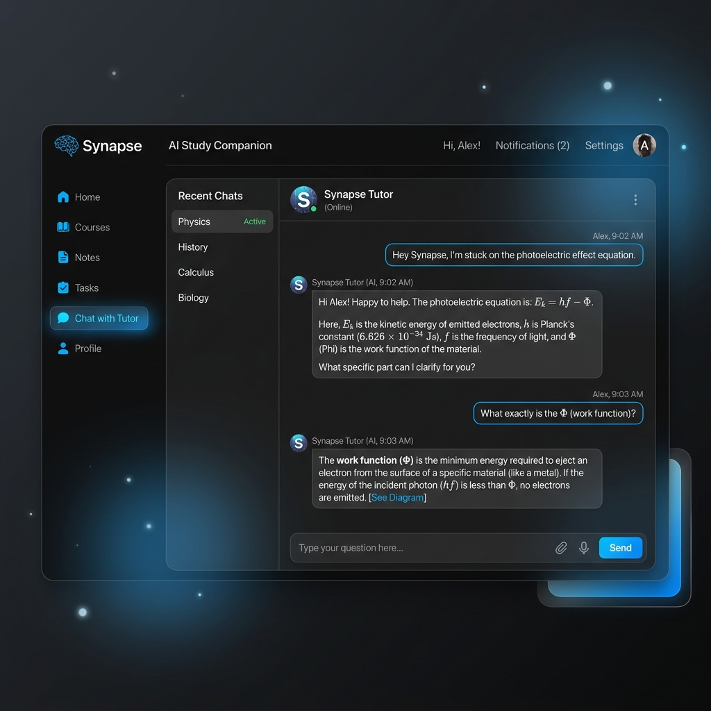

# Synapse: AI Study Companion

 *(Preview placeholder)*

##  What is Synapse?

Synapse is an ultra-fast, adaptive AI study companion built to help students learn effectively through interactive conversation. Operating with lightning-fast streaming and a text-first or voice-enabled interface, Synapse acts as a personalized tutor that adapts to your learning style in real-time.

### The Problem It Solves

Modern students often struggle with passive learning methods—reading textbooks or watching videos without active engagement. While AI chatbots exist, they are often generic, slow, or output overwhelming walls of text. 

**Synapse solves this by providing:**
- **Active Socratic Learning:** It doesn't just give you the answer; it guides you to the answer.
- **Micro-Learning:** Responses are intentionally kept concise (under 40 words) to prevent cognitive overload.
- **Bilingual Support:** Full support for both English and conversational Hindi to serve diverse learners.
- **Local Privacy:** Study sessions and conversation histories are saved entirely locally on your machine, ensuring your learning data remains private.

##  Key Features

- **Ultra-Low Latency Streaming:** Powered by Groq's Llama 3.1 8B Instant model, responses stream onto your screen chunk-by-chunk in milliseconds.
- **Voice Mode with Barge-In:** Enable Voice Mode to have Synapse speak to you using Web Speech API TTS. You can interrupt the AI at any time by typing or clicking the microphone, and it will instantly cancel its speech and listen to you.
- **Rolling Context Window:** Memory management ensures that long study sessions never exceed token limits while maintaining perfect context of the conversation.
- **Session History:** Automatically summarizes and locally saves your study sessions so you can pick up exactly where you left off.
- **Race-Condition Safe:** Local JSON storage is hardened with asynchronous mutex locks to prevent file corruption during rapid saves.

##  Getting Started

### Prerequisites
- Node.js 18+
- A [Groq](https://groq.com/) API Key

### Installation

1. **Clone the repository:**
   ```bash
   git clone https://github.com/yourusername/synapse.git
   cd synapse
   ```

2. **Install dependencies:**
   ```bash
   npm install
   ```

3. **Set up environment variables:**
   Create a `.env.local` file in the root directory and add your Groq API key:
   ```env
   GROQ_API_KEY=your_api_key_here
   ```

4. **Run the development server:**
   ```bash
   npm run dev
   ```

5. **Start learning!**
   Open [http://localhost:3000](http://localhost:3000) in your browser.

##  Technology Stack

- **Frontend:** Next.js 15, React 19, CSS3 (Vanilla)
- **Backend:** Next.js Route Handlers
- **AI/LLM:** Groq API (`llama-3.1-8b-instant`)
- **Speech:** Web Speech API (SpeechRecognition & SpeechSynthesis)
- **Storage:** Local File System (JSON with `async-mutex`)

##  License

This project is licensed under the MIT License - see the [LICENSE](LICENSE) file for details.
